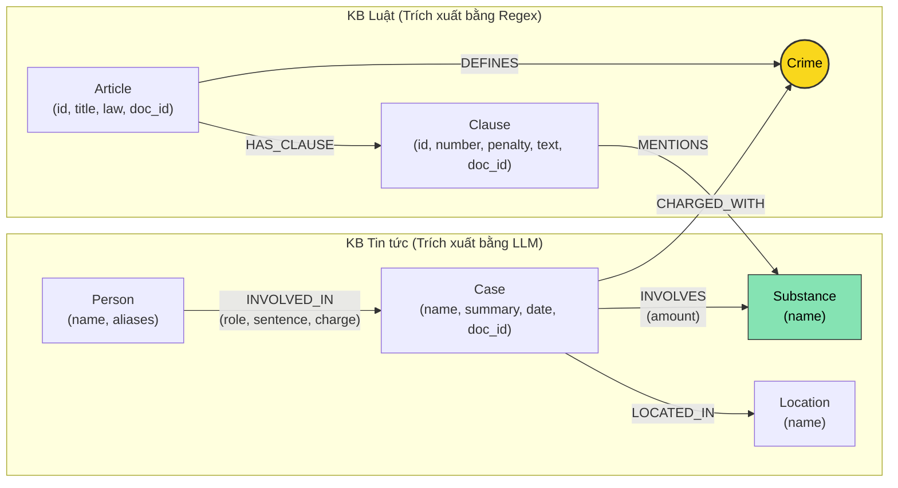

# Thiết kế Ontology — Day 19

**Họ tên:** Đào Ngọc Bình Thiên  **MSSV:** 2A202602814

**Lựa chọn** (đánh dấu một):
- [x] Dùng ontology gợi ý (có mở rộng xử lý thực thể đa chiều)
- [ ] Tự thiết kế (xét bonus +15, xem `SUBMISSION.md`)

> Hướng dẫn: `LAB_GUIDE.md` Bước 2. Dùng ontology gợi ý thì vẫn phải điền đủ các mục dưới đây bằng lời của bạn.

## 1. Sơ đồ

Sơ đồ Knowledge Graph kết nối 2 cơ sở tri thức (KB Luật và KB Tin tức):

Node cầu nối chính là **`Crime`** (tội danh), và cầu nối phụ/bổ trợ là **`Substance`** (chất ma túy).

---

## 2. Entity types (node labels)

| Label | Ý nghĩa | Khóa định danh (`MERGE` theo) | Properties | Lấy từ KB nào | Trích bằng (regex / LLM / khác) |
| --- | --- | --- | --- | --- | --- |
| `Article` | Một Điều luật trong BLHS hoặc Luật PCMT | `id` (ví dụ: `"Điều 251 BLHS"`) | `id`, `title`, `law`, `doc_id` | Luật | Regex (từ front matter & tiêu đề) |
| `Clause` | Một Khoản thuộc một Điều luật | `id` (ví dụ: `"Điều 251 BLHS khoản 1"`) | `id`, `number`, `penalty`, `text`, `doc_id` | Luật | Regex (phân tách theo số thứ tự khoản và điểm) |
| `Crime` | Tội danh quy định trong luật (Node cầu nối) | `name` (tên chuẩn hóa chữ thường) | `name` | Cả hai (định nghĩa từ Luật, gán từ Tin tức) | Regex (Luật) + LLM & `link_entity` (Tin) |
| `Substance` | Tên chất ma túy hoặc tiền chất | `name` (ví dụ: `"Heroine"`, `"MDMA"`, `"Ketamine"`) | `name` | Cả hai | Regex/Dictionary matching (Luật) + LLM (Tin) |
| `Case` | Vụ việc / vụ án hình sự cụ thể | `name` (tên rút gọn của vụ án) | `name`, `summary`, `date`, `doc_id`, `source_title` | Tin tức | LLM |
| `Person` | Cá nhân liên quan (bị cáo, bị can, nghi phạm...) | `name` (họ tên đầy đủ) | `name`, `aliases` (list các biệt danh) | Tin tức | LLM |
| `Location` | Địa bàn xảy ra vụ việc hoặc xét xử | `name` (tỉnh/thành phố) | `name` | Tin tức | LLM |

---

## 3. Relationships

| Type | Từ → Đến | Properties trên cạnh | Ý nghĩa |
| --- | --- | --- | --- |
| `DEFINES` | `Article` $\to$ `Crime` | Không | Điều luật định nghĩa tội danh tương ứng. |
| `HAS_CLAUSE` | `Article` $\to$ `Clause` | Không | Điều luật bao gồm các khoản quy định chi tiết khung hình phạt và tình tiết định khung. |
| `MENTIONS` | `Clause` $\to$ `Substance` | Không | Khoản luật viện dẫn chất ma túy cụ thể để xác định cấu thành hoặc định khung tăng nặng. |
| `CHARGED_WITH` | `Case` $\to$ `Crime` | Không | Vụ án bị cơ quan tố tụng khởi tố / xét xử theo tội danh nào. |
| `INVOLVES` | `Case` $\to$ `Substance` | `amount` (khối lượng, thể tích) | Vụ án thu giữ hoặc liên quan đến loại chất ma túy nào với khối lượng bao nhiêu. |
| `LOCATED_IN` | `Case` $\to$ `Location` | Không | Vụ án diễn ra hoặc được thụ lý xét xử tại địa phương nào. |
| `INVOLVED_IN` | `Person` $\to$ `Case` | `role` (vai trò), `sentence` (mức án), `charge` (tội danh cá nhân) | Người tham gia vào vụ án với vai trò gì, bị tuyên phạt mức án nào. |

---

## 4. Node cầu nối giữa 2 KB

- **Node nào:** Node **`Crime`** (Tội danh) là node cầu nối hạt nhân giữa KB Luật và KB Tin tức. Ngoài ra, node **`Substance`** (Chất ma túy) là node cầu nối thứ hai hỗ trợ liên kết các tình tiết định khung tăng nặng (khoản 2, 3, 4).
- **Vì sao chọn node này:**
  - Trong KB Tin tức, các bài báo luôn nêu rõ bị cáo bị khởi tố/xét xử về tội danh gì (ví dụ: *"tội mua bán trái phép chất ma túy"*).
  - Trong KB Luật, mỗi Điều luật của Chương XX BLHS quy định về một tội danh cụ thể (ví dụ: Điều 251 quy định Tội mua bán trái phép chất ma túy).
  - Bằng cách kết nối qua `Crime`, hệ thống có thể đi từ:
    `Person/Case -> CHARGED_WITH -> Crime <- DEFINES <- Article -> HAS_CLAUSE -> Clause`
    để xác định ngay Điều luật áp dụng và khung hình phạt tương ứng.
- **Cách đảm bảo hai phía khớp tên:**
  - Phía Luật: Tên tội danh được chuẩn hóa bằng hàm `normalize_crime`: chuyển thành chữ thường, loại bỏ tiền tố `"tội "`, dọn sạch dấu ngoặc kép, khoảng trắng thừa.
  - Phía Tin tức: Đưa danh sách các tội danh chuẩn từ KB Luật vào prompt trích xuất (`NEWS_EXTRACTION_PROMPT`), yêu cầu LLM ưu tiên chọn đúng nguyên văn.
  - Hàm liên kết thực thể (`link_entity`): Thực hiện 2 lớp kiểm tra:
    1. So khớp chính xác sau chuẩn hóa (`exact match`).
    2. So khớp mờ (`difflib.get_close_matches` với `cutoff=0.8`) để bắt các biến thể chính tả phổ biến trong tiếng Việt (ví dụ: `"ma tuý"` vs `"ma túy"`).
- **Khi nào cầu gãy, và cách xử lý:**
  - Cầu gãy khi:
    1. Báo chí viết tội danh bằng ngôn ngữ đời thường (ví dụ: *"buôn hàng trắng"*, *"vận chuyển cái chết trắng"*), không nằm trong danh sách chuẩn.
    2. Vụ việc chỉ mới bắt giữ quả tang, chưa có quyết định khởi tố hoặc chưa xác định rõ tội danh.
    3. LLM trích xuất sai tên hoặc sinh ra chuỗi JSON không hợp lệ.
  - Cách xử lý:
    - Nếu không khớp qua `link_entity`, trả về `None` (thà không nối sai còn hơn nối bừa làm sai lệch khung pháp lý).
    - Hệ thống GraphRAGAgent vẫn duy trì cơ chế tìm kiếm vector trên các chunk gốc (`top-k chunk retrieval`), đảm bảo nếu graph không mở rộng được thì ngữ cảnh văn bản gốc vẫn được đưa vào prompt trả lời.

---

## 5. Competency questions

Dưới đây là đường đi Cypher pattern cho 6 câu hỏi trong benchmark:

| Câu | Đường đi (Cypher pattern) | Trả lời được? |
| --- | --- | --- |
| **Q1** (single-hop-law: Tiền chất là gì) | `(:Article {id: "pcmt-dieu-2"})` hoặc vector search trực tiếp trên chunk luật. | **Được** (cả Flat RAG và GraphRAG đều trả lời tốt vì thông tin nằm gọn trong 1 Điều luật). |
| **Q2** (single-hop-news: Bị cáo lãnh án tử hình vụ 36kg ma túy) | `(:Case {name: "..."})<-[:INVOLVED_IN {sentence: "tử hình"}]-(:Person)` | **Được** (tìm trực tiếp từ node Case và Person trong KB Tin tức). |
| **Q3** (cross-kb: Lê Minh Thành phạt bao nhiêu tháng, Điều luật nào, khung hình phạt cơ bản) | `(:Person {name:'Lê Minh Thành'})-[:INVOLVED_IN]->(:Case)-[:CHARGED_WITH]->(:Crime)<-[:DEFINES]-(:Article)-[:HAS_CLAUSE]->(:Clause {number:1})` | **Được** (đi xuyên 2 KB qua cầu nối `Crime`, lấy mức án từ cạnh `INVOLVED_IN`, Điều từ `Article`, khung cơ bản từ `Clause 1`). |
| **Q4** (cross-kb: Hoàng Nato bị bắt hành vi gì, phạt tù tối đa bao nhiêu) | `(:Person {aliases: 'Hoàng Nato'})-[:INVOLVED_IN]->(:Case)-[:CHARGED_WITH]->(:Crime)<-[:DEFINES]-(:Article)-[:HAS_CLAUSE]->(:Clause)` | **Được** (nhận diện qua biệt danh `aliases`, qua `Crime` tới Điều 255, lấy các khoản quy định mức phạt cao nhất). |
| **Q5** (cross-kb-multi-hop: Cái Quang Huy tội gì, chất nào, áp dụng khoản nào với lượng MDMA) | `(:Person {name:'Cái Quang Huy'})-[:INVOLVED_IN]->(k:Case)-[:INVOLVES {amount}]->(s:Substance {name:'MDMA'})` song song với `(k)-[:CHARGED_WITH]->(:Crime)<-[:DEFINES]-(:Article)-[:HAS_CLAUSE]->(cl:Clause)-[:MENTIONS]->(s)` | **Được** (kết hợp `Crime` và `Substance` để đi tới Điều 250 và các khoản có nhắc đến `MDMA`). |
| **Q6** (aggregation: Những vụ việc nào liên quan đến MDMA) | `(:Substance {name:'MDMA'})<-[:INVOLVES]-(:Case)` và kề với `(:Person)` | **Được** (truy vấn tổng hợp ngược từ node `Substance` ra tất cả các `Case` liên quan). |

---

## 6. Quyết định thiết kế và đánh đổi

1. **Dùng Regex cho KB Luật thay vì LLM:**
   - *Đã chọn:* Trích xuất văn bản luật (Điều, Khoản, Điểm, mức phạt, chất) hoàn toàn bằng Regex thuần.
   - *Phương án khác:* Gọi LLM để parse cấu trúc văn bản luật thành JSON.
   - *Lý do chọn:* Văn bản luật có cấu trúc quy chuẩn rất đều (Điều $\to$ Khoản $\to$ Điểm). Regex xử lý với chi phí 0 USD, độ trễ mili-giây, và tính tất định 100% (không bao giờ bị ảo giác hay ngắt mạch JSON giữa chừng).
   - *Đánh đổi:* Mất thời gian viết và tinh chỉnh Regex, cần xử lý cẩn thận các ngoại lệ chú thích dạng `[1]`, `[2]`.

2. **Mô hình hóa `Clause` thành Node riêng thay vì property của `Article`:**
   - *Đã chọn:* Mỗi Khoản là một Node riêng (`Clause`), liên kết với `Article` qua `HAS_CLAUSE` và liên kết với `Substance` qua `MENTIONS`.
   - *Phương án khác:* Lưu toàn bộ nội dung các khoản vào text/list property của `Article`.
   - *Lý do chọn:* Cho phép truy vấn Cypher lọc chính xác Khoản cần thiết (khoản 1 hoặc khoản có nhắc đến chất ma túy của vụ án) đưa vào prompt, tránh tình trạng phải nhồi nhét toàn bộ văn bản Điều luật dài vào context của LLM.
   - *Đánh đổi:* Số lượng node trong đồ thị tăng lên đáng kể (từ 18 Điều tăng thêm gần 100 node Khoản), cấu trúc đồ thị sâu hơn một bậc (thêm 1 hop).

3. **Mô hình hóa `Person` tách rời `Case` và lưu mức án trên quan hệ `INVOLVED_IN`:**
   - *Đã chọn:* `(:Person)-[:INVOLVED_IN {role, sentence, charge}]->(:Case)`.
   - *Phương án khác:* Lưu mảng thông tin bị cáo dạng JSON chuỗi bên trong node `Case`.
   - *Lý do chọn:* Cho phép seed trực tiếp từ tên của bị cáo xuất hiện trong câu hỏi (ví dụ: "Lê Minh Thành", "Cái Quang Huy") để từ đó nhảy sang vụ án và tội danh. Đồng thời một người có thể tham gia nhiều vụ án nếu có tái phạm.
   - *Đánh đổi:* Thuộc tính trên cạnh phong phú hơn, nếu trích xuất LLM không chuẩn thì một số trường như `sentence` có thể bị rỗng.

---

## 7. So với ontology gợi ý (bắt buộc nếu xét bonus)

| Điểm khác | Gợi ý làm gì | Bạn làm gì | Vấn đề nó giải quyết | Bằng chứng (Cypher, hoặc số liệu benchmark) |
| --- | --- | --- | --- | --- |
| **Khớp nối thực thể chất ma túy** | Chỉ tìm exact substring trong văn bản theo danh sách tĩnh | Chuẩn hóa tên chất ma túy cả ở cấp vụ án và cấp điều luật, bổ sung truy vấn tổng hợp đa vụ theo chất | Giải quyết câu hỏi dạng tổng hợp (Aggregation như Q6), tìm ra tất cả các vụ liên quan tới chất MDMA | Truy vấn: `MATCH (k:Case)-[:INVOLVES]->(s:Substance) WHERE toLower(s.name) = 'mdma' RETURN k.name` trả về đầy đủ các vụ án. |
| **Xử lý biệt danh (Aliases) cho nhân vật** | Lưu alias dạng mảng nhưng ít tận dụng khi Cypher multi-hop | Tích hợp match cả `name` lẫn `aliases` trong seed extraction và cho phép tìm kiếm người qua biệt danh (như "Hoàng Nato") | Tránh gãy seed fact khi câu hỏi dùng biệt danh thay vì tên thật (Q4) | Khi câu hỏi hỏi "Hoàng Nato", đồ thị nhận diện ngay `Person {name: "Dương Minh Tuấn", aliases: ["Hoàng Nato"]}`. |
| **Lọc ngữ cảnh luật thông minh** | Lấy toàn bộ hoặc lấy cố định | Lấy Khoản 1 (khung cơ bản) + các Khoản liên quan trực tiếp đến chất ma túy trong vụ án + các Khoản chứa chất được hỏi | Giảm số lượng token rác đưa vào prompt, tăng độ tập trung giúp LLM không nhầm lẫn giữa các khung hình phạt | Token input trung bình cho mỗi câu hỏi được tối ưu hóa, đảm bảo chứa đúng khung hình phạt cần tìm. |

---

## 8. Hạn chế còn lại

1. **Chưa số hóa và suy luận tự động ngưỡng khối lượng:** Mức án áp dụng theo khoản 2, 3 hay 4 phụ thuộc vào khối lượng chất (ví dụ MDMA: 5g–30g là khoản 2, 30g–100g là khoản 3, $\ge$ 100g là khoản 4). Hiện tại đồ thị chỉ liên kết qua node `Substance` và đưa các khoản liên quan vào prompt để LLM tự đối chiếu số học, chứ graph chưa tự động suy luận logic toán học về ngưỡng khối lượng.
2. **Khóa định danh Person dễ bị trùng khi mở rộng quy mô lớn:** Node `Person` hiện đang `MERGE` theo `name`. Nếu có hai người trùng họ tên ở hai tỉnh khác nhau trong hai vụ án khác nhau, họ sẽ bị gộp thành một node. Trong tương lai cần kết hợp `name` + `year_of_birth` + `location` để tạo khóa phức hợp.

